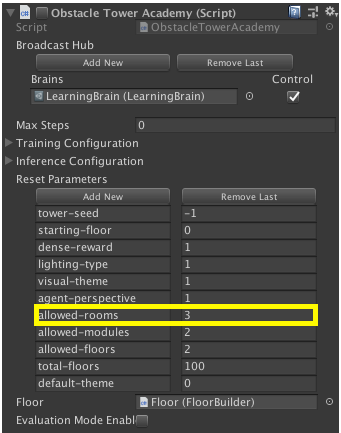

## Creating a custom room type
In order to create a room type for this project, there are several steps which 
may not be obvious to someone new to procedural level generation, or grammars.  
This is a simple guide to help anyone add a custom room type to obstacle tower.   
The changes talked about in this document are located on [this branch](https://github.com/Unity-Technologies/obstacle-tower/commit/865c930b554d363aa45020360853c502dd00260b).

1. Modify `NodeType.cs` to add a new node type.  In this example we’ll add a new node type named `Hazard`.  
We can think of the term node as room moving forward.
```
@@ -12,6 +12,7 @@ namespace ObstacleTowerGeneration.MissionGraph{
         Start = 'S',
         End = 'E',
         Basement = 'B',
-        Connection = 'C'
+        Connection = 'C',
+        Hazard = 'H'
     }
 }
```
2. Add a new folder to the `FloorGeneration/grammar/` directory named `addHazard` with `input.txt` and `output.txt` files. 
3. Update the `grammarList.txt` to add your new grammar.
```
@@ -1,3 +1,4 @@
+addHazard
 addKey
 addKeyLock
 addLever
```
4. Either create a new recipe or add your grammar to an existing recipe. 

## How does a grammar (`input.txt`/`outpu.txt`) work?
At a high level, the `input.txt` and `output.txt` files define a grammar that will modify a 
graph based on their contents.  Let’s take a look at how these files are structured. 

### `input.txt` Structure
```
nodes
0, 0, Any
1, 0, Any
edges
0, 1
```

Here we can see two sections: `nodes` and `edges`.  The nodes section describes the input nodes into this grammar.  

### The `nodes` section
Let’s break down the line: `0, 0, Any`. 
1. The first number `0` is an identifier for this input node, i.e. input node `0`.  It  is 
used in the `edges` section we will talk about next.
2. The second number `0` is used to define an access level. 
3. The final part `Any` is a `NodeType` that is defined in `NodeType.cs`.  This is the type of 
node required for input into this grammar.

### The `edges` section
The edges section is composed of 1 to N lines of pairs of numbers.  These number pairs reference the node 
identifiers from the `nodes` section and represent connections between those pairs of nodes.  

In other words:`0, 1`

defines a connection between node `0` and node `1`.

### `output.txt` Structure
```
nodes
0, 0, Any
1, 0, Any
2, 0, Hazard
edges
0, 2
2, 1

```
This looks very similar to the `input.txt` file with an additional node and new connections.  
If we break this down into steps we see:
1. A new `Hazard` node was added with an identifier `2`
2. There is an `edge` or connection between node `0` and node `2`
3. There is a connection between node `2` and node `1`

### How a grammar modifies a graph
Now that we know what these two files are describing let’s apply it to an example.

Consider a simple graph structured like this:
```
[Normal] -> [Key]
```

If we apply the `addHazard` grammar to this graph the output graph would be:
```
[Normal] -> [Hazard] -> [Key]
```
based on the rules in out `input.txt` and `output.txt` defined above. 

After adding a new grammar for a custom room type, create templates that are instantiated into the 
game as part of the tower generation. 

## Creating room templates
All of the room templates live under the [ObstacleTower/Resources/Templates](../../Templates) folder.  

```
- ObstacleTower
    | ...
    |- Resources
        | ...
        |- Templates
            |- 3
                |- 0
                |- 1
                | ...
            |- 4
                |- 3
                | ...
            |- 5
                |- 5
                | ...
```

There are two levels of directories under the Templates directory.  The first directory is the size of 
the rooms: `3` means a 3 x 3 room, `4` a 4 x 4 room, etc.  The second level is the difficulty level.   
We will need to add a template file for every combination of room size and difficulty level.  
Right now this is done by hand.  You can see changes in [this branch](https://github.com/Unity-Technologies/obstacle-tower/commit/865c930b554d363aa45020360853c502dd00260b)
 for an example of how this could be done.  These templates will allow you to create custom room layouts 
 for your agent to train in.  You can make them as easy or difficult as you want.  

## Modifying the code
1. Modify the `AllowedRoomTypes` enum [EnvironmentParameters.cs](../../Scripts/AgentLogic/EnvironmentParameters.cs)  to add the `Hazard` room type.
```
@@ -60,7 +60,8 @@ public enum AllowedRoomTypes
 {
     Normal,
     PlusKey,
-    PlusPuzzle
+    PlusPuzzle,
+    Hazard
 }
```
2. Change [TemplateRoomGenerateor.cs](../../Scripts/FloorLogic/TemplateRoomGenerator.cs) to make your templates 
available to the procedural dungeon system
```
@@ -18,6 +18,7 @@ public class TemplateRoomGenerator : RoomGenerator
     private List<RoomDefinition> endTemplates;
     private List<RoomDefinition> keyTemplates;
     private List<RoomDefinition> basementTemplates;
+    private List<RoomDefinition> hazardTemplates;
 
     public TemplateRoomGenerator()
     {
@@ -281,6 +282,11 @@ public class TemplateRoomGenerator : RoomGenerator
             case NodeType.Connection:
                 normalTemplates = LoadTemplates($”Templates/{roomSize - 2}/{targetDifficulty}/normals”);
                 return normalTemplates[Random.Range(0, normalTemplates.Count)];
+            case NodeType.Hazard:
+                hazardTemplates = LoadTemplates($”Templates/{roomSize - 2}/{targetDifficulty}/hazards”);
+                return hazardTemplates[Random.Range(0, hazardTemplates.Count)];
             default:
                 normalTemplates = LoadTemplates($”Templates/{roomSize - 2}/{targetDifficulty}/normals”);
                 return normalTemplates[Random.Range(0, normalTemplates.Count)];
```
3. Finally, if you’ve created your own recipe modify [FloorGenerator.cs](../../Scripts/FloorLogic/FloorGenerator.cs) 
to chose your recipe:
    ``` +++ b/Assets/ObstacleTower/Scripts/FloorLogic/FloorGenerator.cs
    @@ -177,6 +177,8 @@ public class FloorGenerator
                     return "graphRecipeNormal";
                 case AllowedRoomTypes.PlusKey:
                     return "graphRecipeKey";
    +            case AllowedRoomTypes.Hazard:
    +                return "graphRecipeHazard";
                 case AllowedRoomTypes.PlusPuzzle:
                     switch (environmentParameters.allowedFloorLayouts)
                     {
    ```
    Along with this change, you will need to:
    1. Open the obstacle tower project in the unity editor
	2. Open the `Procedural` scene
	3. Select the `OstacleTower-v3.0` GameObject in the Hierarchy. 
	4. In the Inspector, navigate tot the `Obstacle Tower Academy` component and change the row in `Reset Parameters`
	named `allowed-rooms` to the ordinal value of the enum.  In this example, set it to `3` (the integer value of `Hazard` in the `AllowedRoomTypes`enum.
	
    
	
	
## Run obstacle tower with your new room type
You can now run the `Procedural` scene of obstacle tower and see the results of your work in real time.   All of 
the changes necessary to add a `Hazard` room [can be found on a branch here](https://github.com/Unity-Technologies/obstacle-tower/commit/865c930b554d363aa45020360853c502dd00260b).  