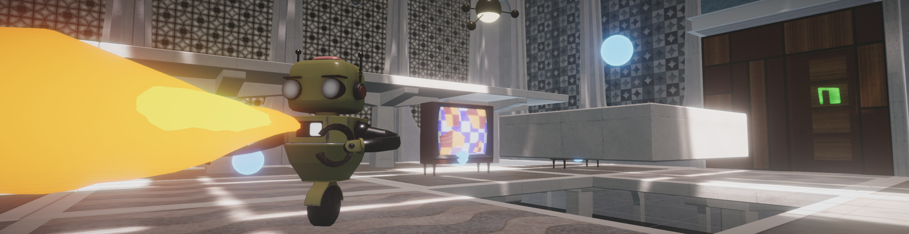
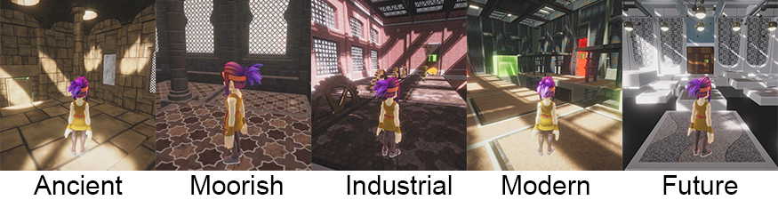
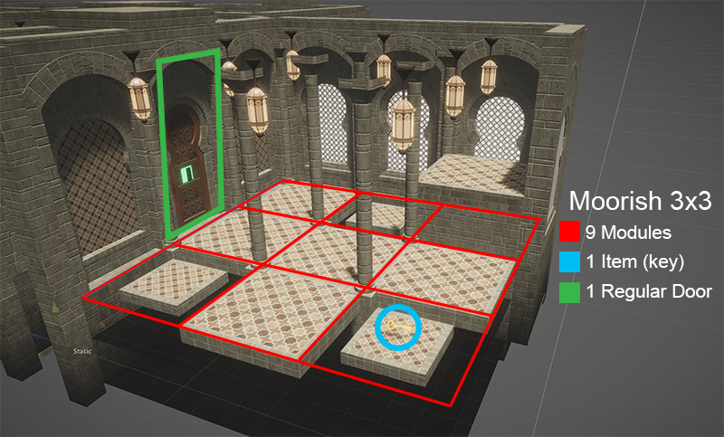
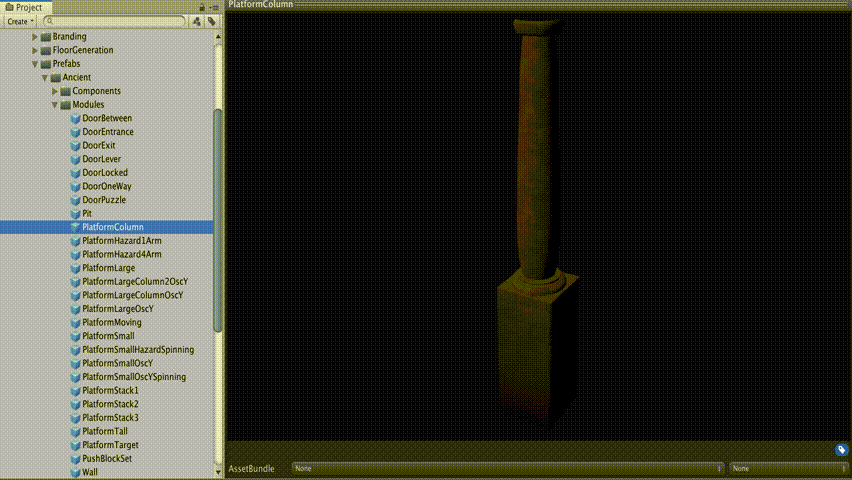

# Understanding and extending Obstacle Tower

Obstacle Tower is designed with modularity and procedural generation in mind. It is possible to modify and extend the systems for room and floor layout with new items, room types, visual themes, and more. This page is dedicated to providing details needed to do this. The project code specific to Obstacle Tower can be found in [`Assets/ObstacleTower`](otc/Assets/ObstacleTower).

## Overview of procedural generation

The Obstacle Tower relies heavily on procedural generation. This procedural generation happens in two phases. 

1. *When the environment is launched or reset*... the definitions for the floor and room layouts are all generated in advance. This process is initalized in the [`FloorBuilder`](Assets/ObstacleTower/Scripts/FloorLogic/FloorBuilder.cs). Specifically this means that a list of [`FloorLayout`](Assets/ObstacleTower/Scripts/FloorLogic/FloorGenerator.cs#L24) objects each filled with a grid of [`RoomDefinition`](Assets/ObstacleTower/Scripts/FloorLogic/RoomDefinition.cs) objects and other meta-data to define the floor are generated. Each [`RoomDefinitions`](Assets/ObstacleTower/Scripts/FloorLogic/RoomDefinition.cs) contains grids of modules and items. The [`FloorGenerator`](Assets/ObstacleTower/Scripts/FloorLogic/FloorGenerator.cs) and [`RoomGenerator`](otc/Assets/ObstacleTower/Scripts/FloorLogic/RoomGenerator.cs) classes generate the [`FloorLayout`](otc/Assets/ObstacleTower/Scripts/FloorLogic/FloorGenerator.cs#L24) and [`RoomDefinition`](Assets/ObstacleTower/Scripts/FloorLogic/RoomDefinition.cs) respectively.
2. *When the agent starts a given floor*... the [`FloorLayout`](Assets/ObstacleTower/Scripts/FloorLogic/FloorGenerator.cs#L24) for that specific floor of the tower is used to generate the scene hierarchy on the fly. [`FloorBuilder`](Assets/ObstacleTower/Scripts/FloorLogic/FloorBuilder.cs) and [`RoomBuilder`](Assets/ObstacleTower/Scripts/FloorLogic/RoomBuilder.cs) are responsible for instantiating the game objects within the scene using the definitions provided, with [`FloorBuilder`](Assets/ObstacleTower/Scripts/FloorLogic/FloorBuilder.cs) creating the room gameobjects, and [`RoomBuilder`](Assets/ObstacleTower/Scripts/FloorLogic/RoomBuilder.cs) creating the module and item gameobjects.

## Visual themes

Obstacle Tower comes with five different visual themes, defined in [`RoomDefinitions`](Assets/ObstacleTower/Scripts/FloorLogic/RoomDefinition.cs). These themes are:



These can be extended by members of the community who are interested in further testing the visual abilities of agents. The prefabs for each theme are located in [`Assets/ObstacleTower/Resources/Prefabs`](Assets/ObstacleTower/Resources/Prefabs). The animations, meshes, and textures for these themes are located in [`Assets/WorldBuilding`](Assets/WorldBuilding). In order to implement a new theme, prefabs for all module types and scenery objects need to be present in the corresponding folder within [`...Resources/Prefabs`](Assets/ObstacleTower/Resouces/Prefabs). This folder must use the same exact name as the added theme enum. See below for the list of current modules which must be implemented.

## Floor layouts

Obstacle Tower uses a generative grammar to create the layout for each floor. For an explaination of this kind of procedural generation method, see [this paper](http://sander.landofsand.com/publications/Dormans_Bakkes_-_Generating_Missions_and_Spaces_for_Adaptable_Play_Experiences.pdf) by Dormans and Bakkes. The code for this process is located in [`Assets/ObstacleTower/Scripts/FloorGeneration`](Assets/ObstacleTower/Scripts/FloorGeneration). It is based heavily on the code in the [GraphDungeonGenerator repository](https://github.com/amidos2006/GraphDungeonGenerator). Please refer to the documentation there for more information on the specifics of this system. The grammar defintions used for the generation process are located in [`Assets/ObstacleTower/Resources/FloorGeneration`](Assets/ObstacleTower/Resources/FloorGeneration). These use a set of grammar rule files, along with a "recipe" which defines how to use these rules, and in what order. This process produces a [`FloorLayout`](Assets/ObstacleTower/Scripts/FloorLogic/FloorGenerator.cs#L24) which contains a 2D array of [`RoomDefinitions`](Assets/ObstacleTower/Scripts/FloorLogic/RoomDefinition.cs), with the spatial position of the rooms in the array corresponding to their position in the environment itself. It also contains additional meta-data describing the room types, and how they connect to one another. 

### Room types

There are multiple different types of rooms in Obstacle Tower, each with unique properties. They are listed below:

* `Normal` - A room with no special properties.
* `Lock` - A room with a `KeyLock` door that requires a key to open.
* `Key` - A room containing a `Key` item.
* `Lever` - A room with a `LeverLock` trap door.
* `Puzzle` - A room with at least one `PuzzleLock` door requiring a puzzle to be solved to open.
* `Start` - A room containing a `Start` door.
* `End` - A room containing an `Exit` door.
* `Basement` - A room containing a `Start` and `Exit` door. (Note: this is used only on floor 0).
* `Connection` - A room containing only `OneWay` doors.

See how to add a new room type [here](Assets/ObstacleTower/Resources/FloorGeneration/AddRoomType.md).

### Door Types

There are multiple different types of doors associated with different room types. They are listed below:

* `Open` - These are doors which the agent can freely move through.
* `KeyLock` - These are doors which require a `Key` item to open.
* `LeverLock` - These are doors which trap the agent behind them once the agent passes through.
* `PuzzleLock` - These are doors which require solving a puzzle in their respective room to open.
* `Start` - These are doors where the agent is spawned at the start of the floor. (Note: Only one of these exists per floor).
* `Exit` - These are doors which take the agent to the next floor upon contact. (Note: Only one of these exists per floor).
* `OneWay` - These doors freely open from only one direction.

### Programatically defining a floor layout

While these floor layouts are typically generated automatically, they can also be programatically defined as well. Below is an example of doing so for a simple one-room floor, with an entry and exit door, corresponding to the `Basement` room used in Obstacle Tower for Floor 0. You can find the corresponding code within the project [here](Assets/ObstacleTower/Scripts/FloorLogic/FloorGenerator.cs#L143).


```c#
// Create a 1x1 empty floor grid
Cell[,] cellGrid = new Cell[1, 1];

// Create a Basement room node
Node node = new Node(0, 0, NodeType.Basement);

// Pick walls for the entry and exit doors
List<int> possibleDoors = new List<int> {0, 1, 2, 3};
int doorStart = possibleDoors[Random.Range(0, possibleDoors.Count)];
possibleDoors.Remove(doorStart);
int doorEnd = possibleDoors[Random.Range(0, possibleDoors.Count)];

// Add the basement room to the floor grid
cellGrid[0, 0] = new Cell(0, 0, CellType.Normal, node);

// Set the entry and exit doors on the walls of the cellGrid
cellGrid[0, 0].doorTypes[doorStart] = DoorType.Start;
cellGrid[0, 0].doorTypes[doorEnd] = DoorType.Exit;

// Create a floor layout with the grid.
var layout = new FloorLayout
{
    floorRoomSize = 5,
    floorLayout = new RoomDefinition[1, 1],
    cellLayout = cellGrid
};
```

## Room layouts

Each [`RoomDefinitions`](Assets/ObstacleTower/Scripts/FloorLogic/RoomDefinition.cs) contains two 2D arrays, one which defines the module placement in the room, and another which defines the item placement in the room. In Obstacle Tower these definitions are generated using text-based templates. These templates are located in [`Assets/ObstacleTower/Resources/Templates`](Assets/ObstacleTower/Resources/Templates). These templates are distributed into templates for different floor sizes, followed by different difficulties, then the templates for each specific room type. For example, the level three difficuty 4x4 puzzle room templates are located in [`Assets/ObstacleTower/Resources/Templates/4/3/puzzles`](Assets/ObstacleTower/Resources/Templates/4/3/puzzles.txt). 

Each template file consists of a number of different templates matching a given difficulty and room type, defined in plain text. Each template consists of a grid of characters, each corresponding to a possible element of a room. Templates are separated by a single blank line. Within each template grid unit, the first character refers to the module, and the second refers to the item. Uppercase letters refer to specific values, and lower-case letters refer to probabalistic values. Note that these templates do not define door placement, as that is determined by the floor layout generation process. These templates are interpreted in the [`TemplateRoomGenerator`](Assets/ObstacleTower/Scripts/FloorLogic/TemplateRoomGenerator.cs), which contains each of the rules for how to interpret each character. Below is an example of a simple template for a 3x3 room with a key.

```
Go GK Go
GX GX GX
GX Go Go
```

Based on the rules defined in [`TemplateRoomGenerator`](Assets/ObstacleTower/Scripts/FloorLogic/TemplateRoomGenerator.cs), `G` refers to a `PlatformLarge` module, `K` refers to a `Key` item, `o` refers to a 50% chance of placing an orb, and `X` refers to no item.



### Modules


Below is a list of modules included in Obstacle Tower:

* `Pit` - No module is placed in this space.
* `Wall` - Used for the walls of the room.
* `WallCorner` - Corner piece to seal room between walls.
* `PlatformLarge` - Basic full-sized ground platform.
* `PlatformColumn` - Contains a large vertical object.
* `PlatformStack2` - Contains two small platforms stacked on the ground.
* `PlatformLargeColumnOscY` - Contains flat surface which oscillates in the Y coordinate.
* `PlatformStack1` - Contains one small platform stacked on the ground.
* `PlatformLargeOscY` - Contains a full-sized platform which oscillates in the Y coordinate.
* `PlatformSmall` - Contains a small platform.
* `DoorEntrance` - Door used to mark start of floor.
* `DoorExit` - Door used to mark end of floor.
* `DoorBetween` - Basic door between unlocked rooms.
* `DoorPuzzle` - Door which requires solving puzzle to open.
* `DoorLocked` - Door which requires key to open.
* `PlatformTall` - Raised statis platform.
* `PlatformMoving` - Platform which moves toward and away from `PlatformTarget`.
* `PlatformSmallOscY` - Contains a small platform which oscillates in the Y coordinate.
* `WallWindow` - A wall containing a window, or secondary decoration.
* `PlatformStack3` - Contains three small platforms stacked on the ground platform.
* `PlatformHazard4Arm` - A moving object on a platform with four apendages. 
* `PlatformHazard1Arm` - A moving object on a platform with one apendage. 
* `PlatformSmallHazardSpinning` - A moving object on a small platform with one apendage. 
* `PlatformSmallOscYSpinning` - A small platform which both moves in the Y coordinate and spins in the X coordinate.
* `PlatformLargeColumn2OscY` - A large platform which moves in the Y coordinate.
* `DoorLever` - A door which the agent can only go through one way, and begins a series of `DoorOneWay`.
* `DoorOneWay` - A door which the agent can only go through one way. 
* `PlatformTarget` - The location a `PlatformMoving` moves toward and from.



By default a room will be instantiated with all `Pit` modules. These can be extended by updating the `ModuleTypes` enum in [`Assets/ObstacleTower/Scripts/FloorLogic/RoomDefinition.cs`](Assets/ObstacleTower/Scripts/FloorLogic/RoomDefinition.cs). For example implementations of these modules, see [here](Assets/ObstacleTower/Resources/Prefabs/Ancient/Modules). When adding an additional module, ensure that the name of the module enum and the name of the prefab match exactly, as these names are used to load the prefabs.

### Items

Below is a list of items included in Obstacle Tower:

* `None` - No item is placed in this space of the room.
* `Key` - A key item which is used to open any `KeyDoor`.
* `Orb` - An object which upon contact provides the agent with additional time.
* `Block` - A movable cube which is used for puzzles.
* `BlockTrigger` - The goal area which blocks must be moved to in order to solve the puzzles.
* `RobotStatic` - A robot which does not move.
* `RobotPatrol` - A robot which moves from its start position to the `RobotPatrolEndWaypoint`.
* `RobotPatrolEndWaypoint` - The end position for the movement of the `RobotPatrol.
* `RobotChasing` - A robot which will chase the agent upon discovering them.
* `BlockReset` - A flat panel in the ground which will reset the `Block` to its starting position.

By default a room will be instantiated with all `None` items. The prefabs for these items can be found in [`Assets/ObstacleTower/Prefabs/Items`](Assets/ObstacleTower/Prefabs/Items).

If you wish to add new Items and use it in the Obstacle Tower, you need to do the following steps. 

1. Update the `ItemTypes` enum in [`Assets/ObstacleTower/Scripts/FloorLogic/RoomDefinition.cs`](Assets/ObstacleTower/Scripts/FloorLogic/RoomDefinition.cs). 
2. Update your Room layout templates under [`Assets/ObstacleTower/Resources/Templates/`](Assets/ObstacleTower/Resources/Templates/) to use your new ItemType. 
3. Update the mapping from the Room layout template to your new `ItemType` in [`Assets/ObstacleTower/Scripts/FloorLogic/TemplateRoomGenerator.cs`](Assets/ObstacleTower/Scripts/FloorLogic/TemplateRoomGenerator.cs). 
4. Update your Room.prefab in [`Assets/ObstacleTower/Prefabs/Required/Room.prefab`](Assets/ObstacleTower/Prefabs/Required/Room.prefab) to use your new prefab that correspond to your new ItemType.
5. Update your mapping between your new `ItemTypes` and your new prefab in [`Assets/ObstacleTower/Scripts/FloorLogic/RoomBuilder.cs`](Assets/ObstacleTower/Scripts/FloorLogic/RoomBuilder.cs).
